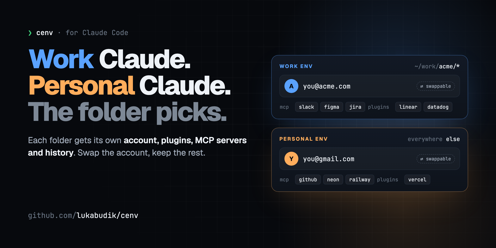

<p align="center">
  
</p>

<h1 align="center">cenv</h1>

<p align="center">
  <b>Separate Claude Code environments, picked by the folder you're in.</b><br>
  Its own account, plugins, MCP servers and history per environment. Swap the account, keep the rest.
</p>

<p align="center">
  <a href="https://github.com/lukabudik/cenv/actions/workflows/test.yml"></a>
  <a href="https://github.com/lukabudik/cenv/releases"></a>
  
  
  <a href="#option-a-let-claude-code-do-it-recommended"></a>
  <a href="LICENSE"></a>
</p>

<p align="center">
  <a href="#install">Install</a> ·
  <a href="#how-it-works">How it works</a> ·
  <a href="#swap-the-account-keep-the-environment">Account swapping</a> ·
  <a href="#commands">Commands</a> ·
  <a href="#gotchas">Gotchas</a> ·
  <a href="docs/desktop-app.md">Desktop app (experimental)</a>
</p>

---

Work repos get your work login, the company's plugins, MCP servers and connectors.
Everything else gets your personal login, personal plugins and personal history.
No flags, no aliases to remember. You `cd` and run `claude`.

```console
~/work/acme/api $ cenv
  env      work (directory rule)
  config   /Users/you/.claude
  account  you@acme.com

~/side-project $ cenv
  env      personal (directory rule)
  config   /Users/you/.claude-personal
  account  you@gmail.com
```

## What gets separated

Everything Claude Code keeps in its config directory, per env:

| | |
|---|---|
| **Login** | a different account per env, both logged in at the same time |
| **Settings** | `settings.json`: permissions, hooks, model, theme |
| **Plugins & skills** | e.g. company plugins only in work; your own in personal |
| **MCP servers** | user-scope servers and their OAuth logins |
| **Connectors & org policy** | claude.ai connectors and managed settings come with the account |
| **Memory & history** | `CLAUDE.md`, sessions, `/resume` list, auto-memory |

Repo-level config (`.claude/settings.json`, `.mcp.json`, project `CLAUDE.md`) still applies
in whichever env you open the repo with.

## How it works

Claude Code reads everything from the directory in `CLAUDE_CONFIG_DIR` (default
`~/.claude`). Point it somewhere else and you get a fully independent environment.

cenv is a ~200-line zsh/bash hook. On every `cd` it checks your rules and sets
`CLAUDE_CONFIG_DIR` to match. That's all it does:

```
~/.config/cenv/config
  env   work      ~/.claude            @acme.com
  env   personal  ~/.claude-personal

  rule  ~/work/acme   work         ← this folder and below
  rule  *             personal     ← everywhere else
```

```
cd ~/work/acme/api  →  CLAUDE_CONFIG_DIR unset           →  work env
cd ~/anything-else  →  CLAUDE_CONFIG_DIR=~/.claude-personal  →  personal env
```

## Swap the account, keep the environment

cenv separates two things that are easy to mix up:

| | Decides | Picked by |
|---|---|---|
| **Environment** | plugins, MCP servers and their logins, skills, settings, history | the folder (cenv) |
| **Account** | who is logged in and who pays | whatever you log in with, swappable with [claude-swap](https://github.com/realiti4/claude-swap) |

Hit a rate limit or a spend cap? Swap the account and keep working in the same
environment:

```bash
uv tool install claude-swap        # or: pipx install claude-swap
cd ~/work/acme/api
cswap add                           # register the account that's logged in now
claude                              # /login with the other account, then:
cswap add
cswap switch you@gmail.com          # swap whenever you need to
```

This works with no extra wiring: cswap reads `CLAUDE_CONFIG_DIR`, so plain `cswap` in a
work folder acts on the work env. From anywhere else, target an env explicitly with
`cenv exec work cswap switch 2`. Restart running sessions after a swap.

What stays: plugins, user-scope MCP servers and their OAuth logins, skills, settings,
history. What changes with the account: claude.ai connectors and org-managed settings.
The status line turns magenta while an env runs on an account that doesn't match its
`expected-account`, so you notice.

## Install

### Option A: let Claude Code do it (recommended)

```bash
claude plugin marketplace add lukabudik/cenv
claude plugin install cenv@cenv
```

Then in a Claude Code session: **"set up cenv"**. The `setup-cenv` skill checks your
current setup, asks which folders belong to which env, installs the hook, wires up the
status line and verifies everything. It never touches your existing `~/.claude`. The only
manual step is logging in to the new env.

### Option B: by hand (2 minutes)

```bash
curl -fsSL https://raw.githubusercontent.com/lukabudik/cenv/main/install.sh | bash
# or: git clone https://github.com/lukabudik/cenv && ./cenv/install.sh

$EDITOR ~/.config/cenv/config      # your envs and folder rules
exec $SHELL                        # load the hook
cenv list                          # check the mapping
cd ~/some-personal-folder && claude   # log in to the new env once
```

The installer copies two scripts to `~/.config/cenv/`, creates the config if missing, and
appends a marked 3-line block to `~/.zshrc` or `~/.bashrc`. Re-running it is safe.

**Which env keeps `~/.claude`?** The one already logged in there, usually work. Its
plugins, history and company-managed settings stay exactly as they are. The new env
starts empty in `~/.claude-<name>`.

## Config

```
env   <name>  <config-dir>  [expected-account]
rule  <path>  <env>
```

- **env**: a name and its config dir. `expected-account` is optional: any part of the
  email you expect there (`@acme.com`). The status line turns magenta on a mismatch.
- **rule**: a folder and everything below it. **First match wins.** Put specific paths
  first and `*` last. Symlinked paths resolve either way.
- More than two envs is fine (e.g. a client env).

## Commands

| | |
|---|---|
| `cenv` | active env, config dir, logged-in account |
| `cenv list` | all envs with their accounts, and the rules |
| `cenv which [dir]` | which env a folder maps to |
| `cenv pin <env>` / `cenv unpin` | override the folder rule for this terminal tab |
| `cenv run <env> [args]` | launch `claude` once in an env |
| `cenv exec <env> <cmd>` | run any command against an env, e.g. `cenv exec personal claude mcp add -s user ...` |
| `cenv edit` | edit the rules |

## Status line (optional)

Shows which env and account you're in, so you never wonder:

```
work·acme.com | api | main* | Opus 5.5 | ctx:64%
```

Add to each env's `settings.json`:

```json
"statusLine": { "type": "command", "command": "bash ~/.config/cenv/statusline.sh" }
```

Already have a status line? Prepend `bash ~/.config/cenv/statusline.sh --badge` to it.

## Gotchas

1. **Never `export CLAUDE_CONFIG_DIR=~/.claude`.** On macOS the Keychain entry name is
   derived from the raw variable value. The explicit default path looks for a different
   entry and reads as logged out. cenv selects `~/.claude` by *unsetting* the variable.
2. **Terminal only.** The hook runs in your shell. IDE extensions and the desktop app use
   the environment they were started with (VS Code's integrated terminal is fine). For the
   desktop app there's an experimental route, one app copy per env:
   [docs/desktop-app.md](docs/desktop-app.md). Testers wanted.
3. **Restart sessions after logging in or switching accounts.** The credential is read at
   startup.
4. **MCP servers and their OAuth are per env.** Add them from a folder of that env, or
   use `cenv exec <env> claude mcp add -s user ...`.
5. **Connectors and org-managed plugins/settings follow the account, not the folder.**
   You can't copy them into another env. Logging in brings them.
6. **Remove any other `CLAUDE_CONFIG_DIR` exports or `claude` aliases** from your rc
   files. The installer warns if it finds one.

## Uninstall

```bash
./uninstall.sh   # or: curl -fsSL https://raw.githubusercontent.com/lukabudik/cenv/main/uninstall.sh | bash
```

This removes the hook and scripts. Your config dirs, logins and `~/.config/cenv/config`
are kept.

## Development

```bash
test/run.sh       # hook in zsh + bash 3.2/5, status line
test/install.sh   # installer/uninstaller round trip in a throwaway HOME
```

Requirements: zsh or bash 3.2+, macOS or Linux (Windows via WSL). `jq` is optional; the
status line works best with it.

MIT © Luka Budik
